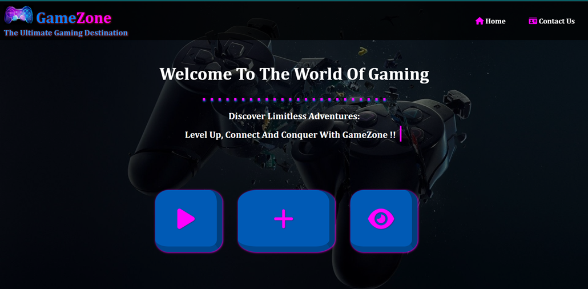
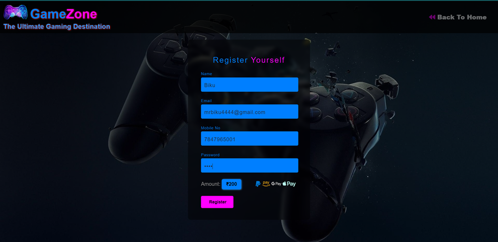
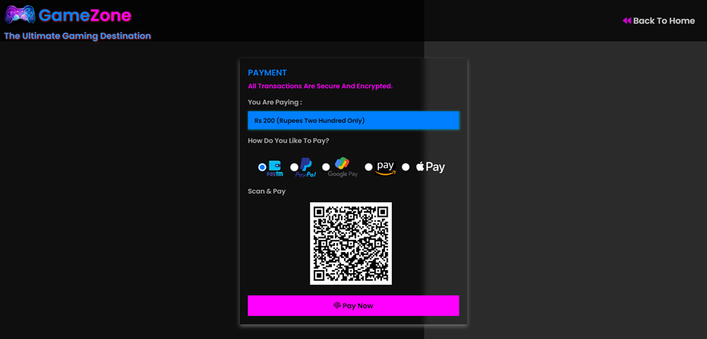
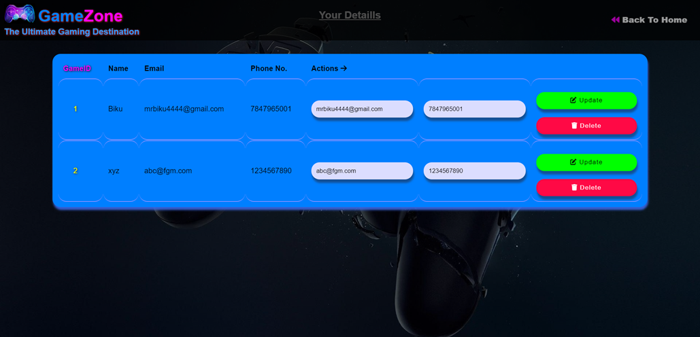
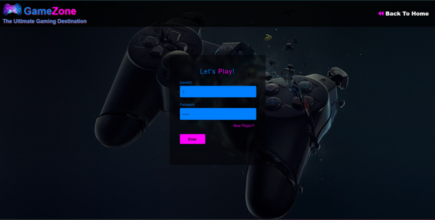
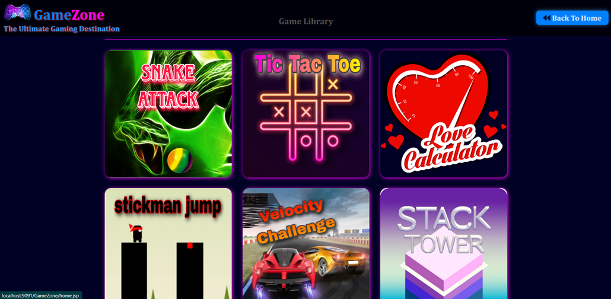
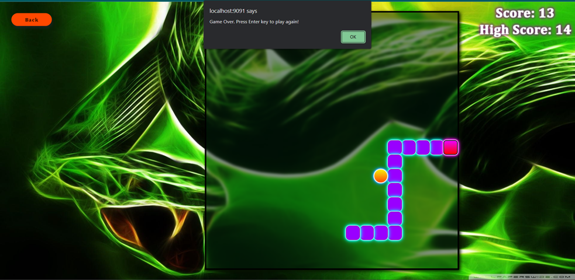
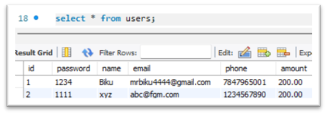
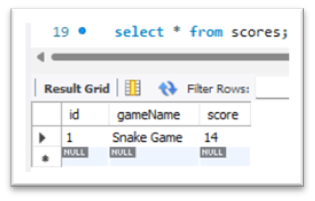

# World-Clock

Project Name: Game Zone: The Ultimate Gaming Destination
Date: 21/04/2023 to 5/05/2023
Introduction:
Game Zone is an online gaming website that offers a one-stop destination for gaming enthusiasts. The website is built using HTML, CSS, JavaScript, JSP, MySQL, and JDBC technologies.
Features:
• The Home page of Game Zone consists of two tabs: Home and Contact Us.
• In Home page there are three buttons: Quick Play, Game Registration, and View Details.
• Users can register themselves by providing their name, email, phone number and password, and paying a registration fee for it. And these details are stored in the users database.
• View Details page generates a random gaming ID for each user. So, after registration, users are required to go to the View Details page to obtain their randomly generated gaming ID.
• Quick Play button authenticates users through the user database to access the Game Library page.
• Game Library page includes eight games, such as Tic-tac-toe, Stickman Jump, Stack tower, Love calculator, Velocity Challenge, Astro Assault, Flappy Bird and playable piano. From there, the users can select a game to start playing.
• The real-time scores for each game are displayed at the top of the page, and the high scores are stored and retrieved from the database.
• Finally, users can contact the website administrators through the Contact Us tab.
Workflow:
• User visits the Game Zone website.
• User register by providing their name, email, phone number and password, and user have to pay a registration fee for it.
• View Details page generates a random gaming ID for each user.
• User clicks on the Quick Play button to access the Game Library page.
• User selects a game and starts playing.
• Real-time score display for each game and high scores are stored and retrieved from the database.
• Users can contact the website administrators through the Contact Us tab.
Sample Output:

Database:
 
Conclusion:
Game Zone provides an exciting gaming experience for users with its extensive range of games and real-time score display. The use of modern technologies such as JSP, HTML, CSS, JavaScript, MySQL, and JDBC ensures a smooth and efficient user experience.

Submitted By-
Dibya Ranjan Rath (SIC- 20BCSE62, B2_12)
